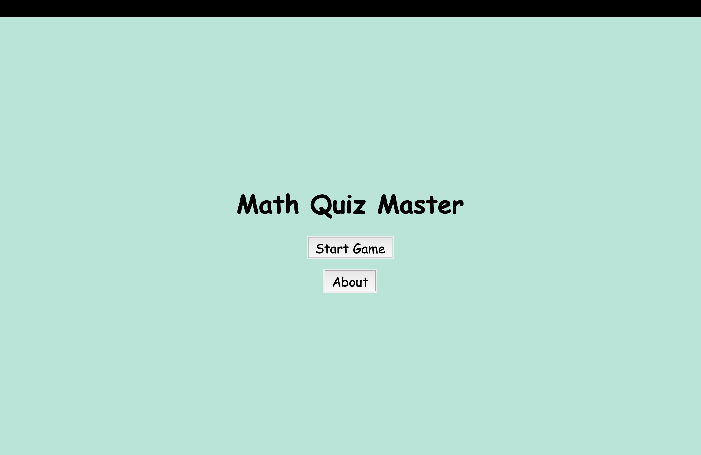
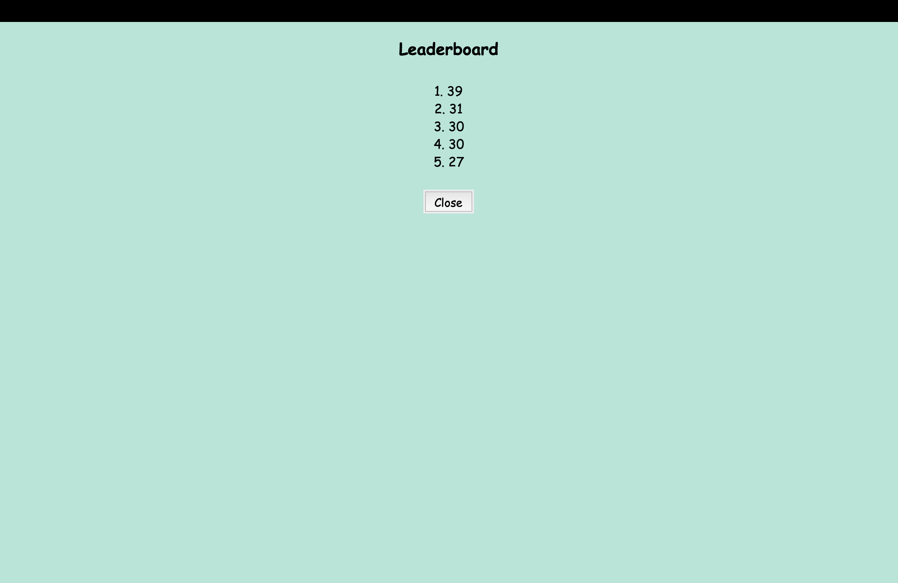

# Math Quiz Master

**Math Quiz Master** is an engaging and dynamic math quiz game built using Python and Tkinter. Challenge yourself to solve as many math problems as possible within the time limit while advancing through progressively harder levels. 🎮

---

## Table of Contents

1. [Introduction](#introduction)
2. [Features](#features)
3. [Installation](#installation)
4. [How to Play](#how-to-play)
5. [Screenshots](#screenshots)
6. [Technologies Used](#technologies-used)
7. [License](#license)
8. [Acknowledgments](#acknowledgments)

---

## Introduction

Math Quiz Master is designed to test your math skills under pressure. This project is perfect for individuals who enjoy solving math problems and competing for high scores. With real-time feedback, a leaderboard to track top scores, and a clean, minimalist design, this game ensures both fun and focus.

---

## Features

- **Full-Screen Mode**: The game launches in full-screen mode for an immersive experience.
- **Dynamic Difficulty**: Levels increase in difficulty based on your score:
  - **Easy**: Basic addition and subtraction.
  - **Medium**: Multiplication and division.
  - **Hard**: More challenging problems.
- **Real-Time Feedback**: Immediate feedback on whether your answer is correct or incorrect.
- **Timer**: A 60-second countdown to test your problem-solving speed.
- **Leaderboard**: Track the top scores and compete with others.
- **Home Button**: Navigate seamlessly back to the main menu.
- **Background Music**: Enjoy a relaxing background tune while playing.

---

## Installation

### Prerequisites

- Python 3.6 or higher.
- Required Python libraries:
  ```bash
  pip install pygame
  ```

### Steps

1. Clone the repository to your local machine:
   ```bash
   git clone <repository_url>
   ```

2. Navigate to the project directory:
   ```bash
   cd MathQuizMaster
   ```

3. Run the game:
   ```bash
   python finalproject.py
   ```

---

## How to Play

### Main Menu

- **Start Game**: Begin the math quiz.
- **About**: Learn more about the game.

### Gameplay

1. Solve math problems displayed on the screen.
2. Choose the correct answer from four options.
3. Earn points for correct answers and progress to harder levels.
4. A timer counts down from 60 seconds.

### Post-Game Options

- **Restart Game**: Start a new game session.
- **Show Leaderboard**: View the top scores.
- **Home**: Return to the main menu.

---

## Screenshots

### Main Menu


### Gameplay


### Leaderboard


---

## Technologies Used

- **Programming Language**: Python
- **GUI Framework**: Tkinter
- **Music Library**: Pygame

---

## License

This project is licensed under the MIT License. See the [LICENSE](./LICENSE) file for details.

---

## Acknowledgments

- **Pygame Documentation**: [https://www.pygame.org/docs/](https://www.pygame.org/docs/)
- **Tkinter Documentation**: [https://docs.python.org/3/library/tkinter.html](https://docs.python.org/3/library/tkinter.html)

Thank you for exploring **Math Quiz Master**! If you have any feedback or suggestions, feel free to contribute or raise an issue in this repository.

